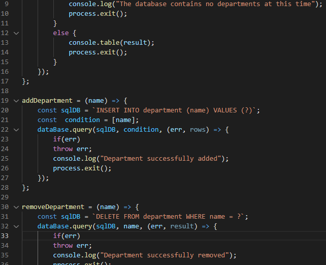

# Labor-Logger-Extraordinaire
  
## Description
Labor Logger Extraordinaire is an executive business application that allows adminstrative business staff to store, view, and manage simple employee data. This application is run via the terminal, or command line, and requires installation and use of Node.js, MySQL2, and Inquirer.

## User Story
* AS A business owner

* I WANT to be able to view and manage the departments, roles, and employees in my company

* SO THAT I can organize and plan my business

## Table of Contents
- [Built With](#languages)
- [Source Code Screenshot](#Code)
- [Installation](#Install)
- [Usage](#Usage)
- [Contribution](#contributing)
- [Questions](#questions)

## Built With
* JavaScript

## Source Code Screenshot

## Installation

Node.js, MySQL2, and the Inquirer.js npm packages are necessary to run this application. Copy the files or simply clone the repository. Navigate to the repository via the terminal and run
<code> npm init </code> follow the prompts until finished. Next, enter <code> node install inquirer mysql2 sequelize console.table </code> from the the root of the directory.

If you're having trouble, take a look at my installation/running the application walkthrough video [Here]()

## Usage

After succussful installation and setup, you must createa new database via the MySQL shell command terminal. In the MySQL shell, type the command <code> mysql -u root -p </code>. If you entered this correctly, you should be prompted to type in your password. Enter your password and type the command <code> source db/schema.sql </code> to intiate database and table creation. Now you can exit the MySQL shell, and type <code> npm start </code> in your terminal, making sure you are still in the root directory. If everything was done correctly you can now follow the prompts to manage your info.

## Contribution
- This project was made by Evan Carlson and contains references and material learned in the University of Minnesota Web Dev Bootcamp.

No Outside Contributions are being accepted at this time.

## Questions
If you have any questions on this application, feel free to reach me through my GitHub profile [epc318](https://github.com/epc318) or [E-mail](carl4917@umn.edu):

### ©️2022  Profession Pointers, Inc.